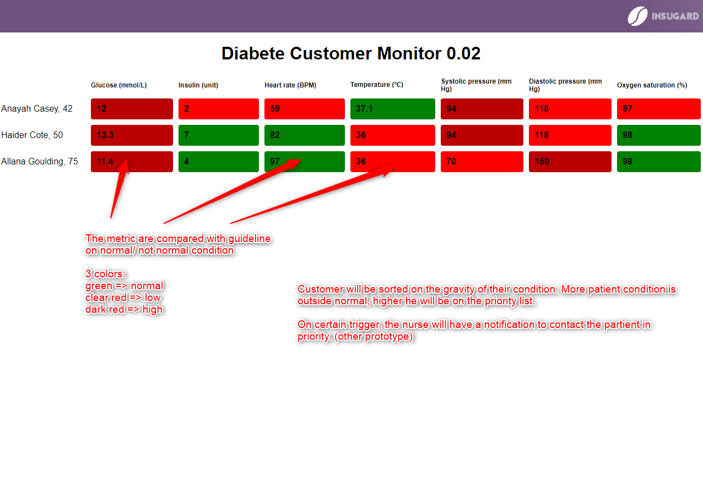
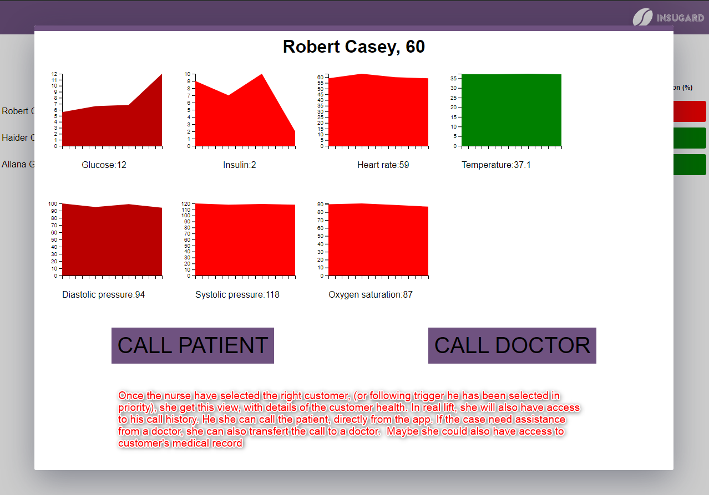

# Diabete Customer monitor

## Short explanation of the solution


Diabete pump can be connected to the internet and transmit data to the equipement provider, where a nurse can monitor data. She'll have a view with all her customer. Once she click on a customer, she'll be able to check his specific data and evolution, and to call the patient or the doctor if necessary. 






## Project setup
You will need 

```
npm install
```

### Compiles and hot-reloads for development
```
npm run serve
```

### Compiles and minifies for production
```
npm run build
```

### Lints and fixes files
```
npm run lint
```

### Customize configuration
See [Configuration Reference](https://cli.vuejs.org/config/).


